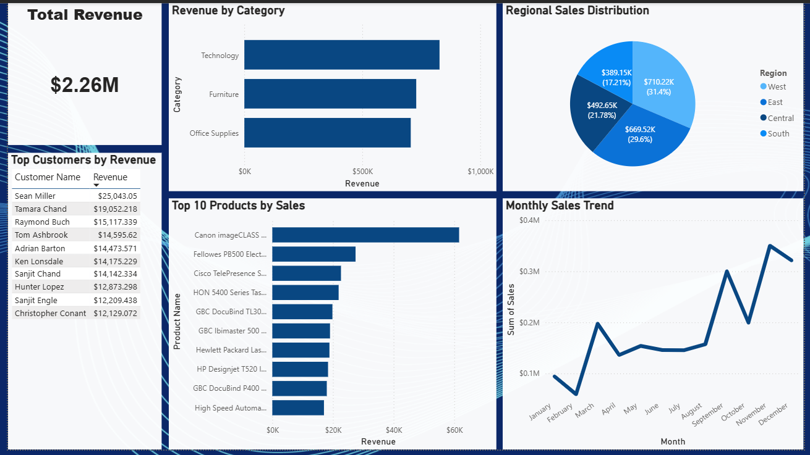

# E-Commerce Sales Analytics Dashboard


## Project Overview

This project analyzes an **e-commerce retail dataset** to identify revenue trends, top-performing products, customer purchasing behavior, and regional sales distribution.  

The project demonstrates a **complete data analytics workflow**, including:

- Data exploration and cleaning using Python
- Business analysis using SQL queries
- Interactive dashboard creation using Power BI


## Tools & Technologies

- **Python (Pandas, Matplotlib)** – Data exploration and preprocessing  
- **SQL (MySQL)** – Business query analysis  
- **Power BI** – Dashboard visualization  


## Dataset

- **Dataset:** Superstore Sales Dataset  
- **Records:** ~9,800 transactions  
- **Features:** 18 columns including:

- Order Date  
- Customer Name  
- Product Name  
- Category  
- Region  
- Sales  


# SQL Analysis Performed


- Total Revenue
- Revenue by Product Category
- Top Products by Sales
- Regional Sales Performance
- Highest Revenue Customers
- Monthly Sales Trend 


# Dashboard Features

The Power BI dashboard includes:

- **Total Revenue KPI**
- **Revenue by Product Category**
- **Regional Sales Distribution**
- **Top 10 Products by Revenue**
- **Top Customers by Revenue**
- **Monthly Sales Trend**


# Key Insights

- **Technology category generated the highest revenue**, outperforming Furniture and Office Supplies.
- **Western region contributed the largest share of total sales**.
- A **small group of customers generated a large portion of revenue**, highlighting high-value customers.
- Sales trends indicate **strong growth toward the end of the year**, suggesting seasonal demand.


# Project Structure

```
ecommerce-sales-analytics
│
├── data
│   └── superstore.csv
│
├── sql
│   └── analysis_queries.sql
│
├── dashboard
│   └── dashboard_screenshot.png
│
├── sales_analysis.ipynb
└── README.md
```

# Dashboard Preview



